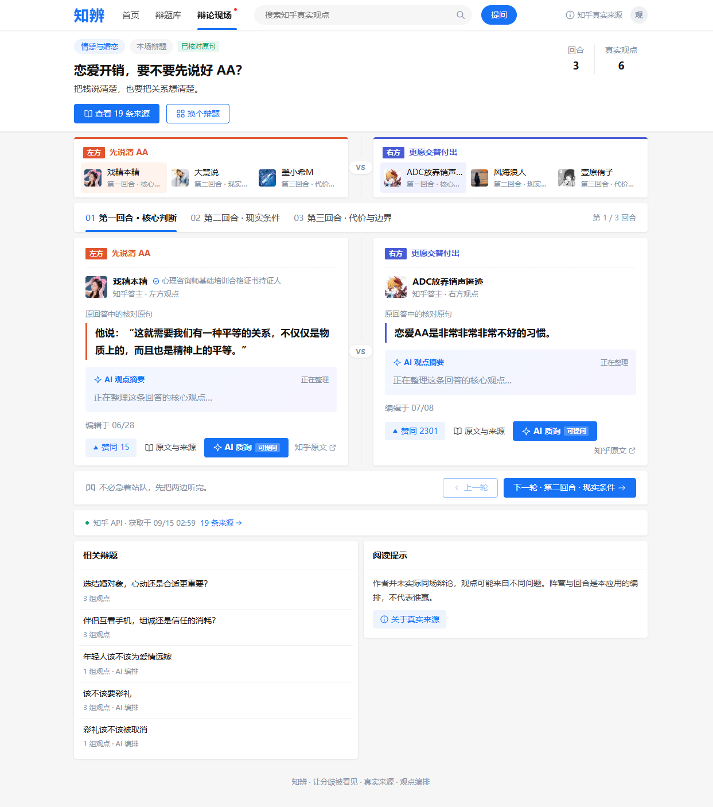
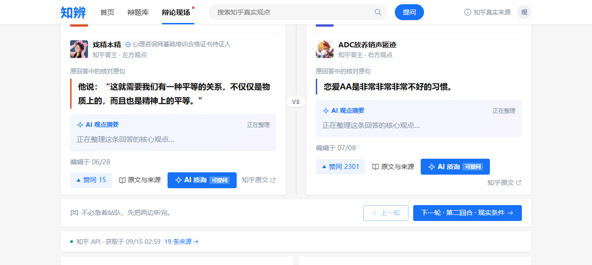
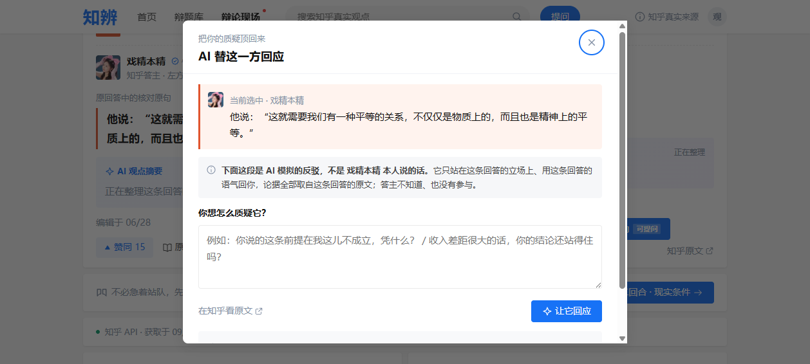
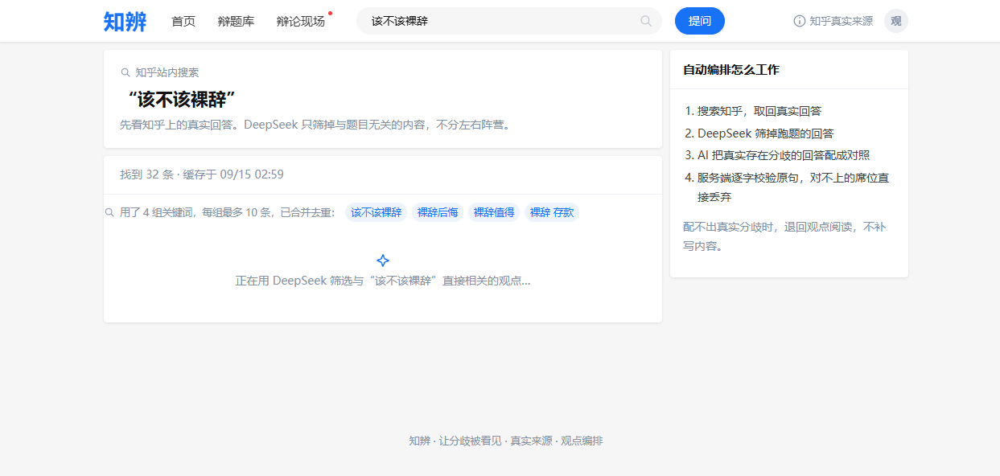
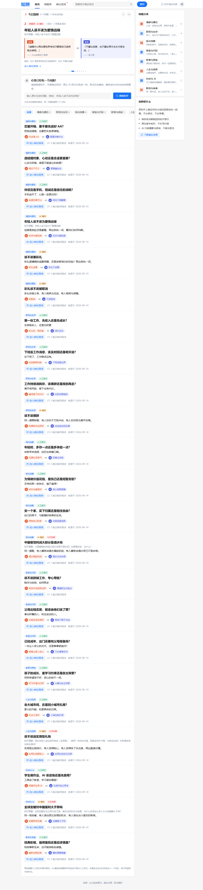
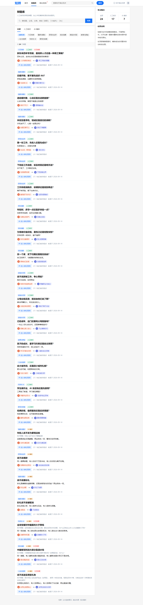

# 知辨 · 产品说明计划书

> 知乎黑客松 2026 · 校园新锐季 · 知识炼金场赛道
>
> **知辨 —— 让分歧被看见，让每一句都有出处**
>
> 把知乎上真实存在分歧的回答，摆到同一张桌子上


- 形态：Web 应用（桌面 + 手机浏览器）
- 架构：同源 Web + Node，无第三方运行依赖
- 时间：2026 年 9 月

---

## 一、我们要解决什么问题

一个真正有争议的问题，在知乎上往往有几百条回答、吵了几百楼。但大多数用户的时间线里，只会看到算法推给他的那一种声音。

用户想认真了解「该不该裸辞」「AI 该不该进课堂」这类问题时，面临三个真实困境：

1. **只听得见一边** —— 高赞回答挤占了注意力，立场相反的低赞优质回答几乎没有曝光机会；
2. **AI 摘要工具在「编」** —— 通用 AI 总结不区分事实与观点，常常把不存在的内容合成进去，且无法溯源；
3. **跨回答对比成本极高** —— 要自己开十几个标签页、逐条阅读、在脑子里拼出正反两面；
4. **听道理这件事太枯燥** —— 现有的知识工具把严肃话题做成干巴巴的清单和摘要，正确，但没人想看第二眼。

> **知辨的选择：不生成内容，只编排已有的真实回答——并且把它做成一场好看的比赛。**

前三个是「准确」的问题，第四个是「愿意看」的问题，而后者往往被工具类产品忽略。可是「看两个人辩论」从来不需要坚持：《奇葩说》能让人熬夜追更，公开课却总在收藏夹吃灰。**辩论是最古老的知识形式，也是最好看的那种**——立场对撞有张力，攻防反转有悬念，金句交锋有爽感。

知辨把这一点做成产品的骨架：**知识获取不该是苦役，它可以是娱乐**。你为了「好看」点进来，走的时候顺便把两边的道理都听完了——而保证这场比赛好看的，正是前面说的戏剧性张力：极端情境下的对峙，与留给第三方的启发（见第二节）。

知辨围绕一个问题，把**立场相反的真实回答**摆到同一张辩论桌上：一边一句核对过的原句，逐字可溯源；AI 只在用户主动点击时介入，并且永远与作者原文严格分区。

---

## 二、核心创作思路

三条支柱，同时也是产品三条不可退让的底线：

| | 底线 | 含义 |
|---|---|---|
| 01 | **绝不用虚构内容补位** | 找不到立场对立的真实回答，就退回「观点阅读」模式，并如实告诉用户为什么。宁可少一个回合，绝不合成一个回合。 |
| 02 | **AI 内容与作者原文严格分区** | AI 摘要、AI 编排、AI 模拟反驳都有醒目标注；引句永远标着「原回答原句 · 已逐字校验」。用户任何时刻都能分辨哪句是人说的、哪句是 AI 说的。 |
| 03 | **编排而不裁决** | 知辨不告诉你谁对谁错，不显示胜负票数。它只保证一件事：你听到的每一句都是知乎原话，都能点回原文。 |

### 戏剧性的张力：极端情境，与第三方的启发

辩论这种形式自带戏剧张力——**它把两拨人放进同一个极端情境里讨论**：每个立场被推到聚光灯下，正面的道理与反面的道理短兵相接，任何含糊都无处可藏。

而知辨做的，是把这个张力**从虚构拉回真实**：舞台上对峙的两位，是真实存在、立场真的相反的知乎答主。极端情境是我们搭的舞台装置——作者本人并不知道、也没有参与，但说出的每一个字都是他们自己的原话。张力不靠编造，靠的是真实分歧本身。

张力之外还有一层价值：**启发属于第三方**。看两人对峙的观众——也就是正在阅读的你——才是这场辩论真正的受益者。你不需要站队，你只需要在两边的道理互相顶撞的那一下，想清楚自己的答案。

### 一场辩论的诞生

以辩题「恋爱开销，要不要先说好 AA？」为例，用户看到的是一个三回合的辩论现场——每一句引言都是答主回答里的原句：



*辩论现场：三回合 · 六条真实观点 · 每句标注「原回答中的核对原句」，可一键回知乎查证*

### 当 AI 只在主动点击时介入

| AI 观点摘要（一句一行） | AI 质询（模拟反驳） |
| --- | --- |
|  |  |

- 左：AI 观点摘要，一句一行，只提炼不演绎；
- 右：AI 质询弹窗——明确标注「**这是 AI 模拟的反驳，不是答主本人说的话，答主不知道、也没有参与**」，反驳论据只允许取自该回答原文。

这是我们对「AI 模拟」的态度：**模仿立场可以，冒充本人不行**。弹窗里的这句声明不是法律免责，而是产品的诚实加分项。

---

## 三、整体技术实现方案

### 3.1 Agent 式检索管线：用多关键词突破搜索上限

知乎搜索一次最多返回 10 条结果——单一查询就像一个窄窗口，立场相反的回答经常被排在窗口之外。知辨把它做成了一个**小型 Agent 管线**，六步里有两步由模型自主决策、两步有确定性守卫：

```
① AI 扩词（按正反用词生成多组关键词）
        ↓
② 多路搜索（每组各搜一次，各取 10 条）
        ↓
③ 合并去重（候选池 10 → 30+ 条）
        ↓
④ AI 相关性筛选（只留直接讨论该题的回答）
        ↓
⑤ AI 编排配对（把立场相反的回答配成回合）
        ↓
⑥ 逐字校验 + 独立复核
```

三道确定性守卫：

- **守卫 A · 原句逐字定位**：引句必须在回答原文中逐字找到，容忍空白差异；
- **守卫 B · 独立复核**：另一位 AI 裁判独立判断「两边作者是否真的立场相反」，同向配对直接删；
- **守卫 C · 诚实降级**：配不出真实分歧就退回观点阅读，不补写。

生成的关键词按辩题**落盘复用**（行为可复现，不重复烧调用）；若某题已知回合不完整，本轮自动重掷一套关键词再试。用户在加载时能实时看到管线的每一步真实进度——「是真在搜，不是装忙」：



*搜索页如实展示：「用了 4 组关键词，每组最多 10 条，已合并去重」——找到 32 条真实回答；右侧同步解释自动编排的校验流程*

### 3.2 界面与美术：一套原生的知乎风格 UI

知辨没有发明自己的视觉语言——它直接长在知乎的设计基因上，**从布局到配色全是知乎风**：

- **布局**：顶栏 + 主信息流 + 右侧栏的三栏结构；辩题以信息流行呈现（标题 / 知乎原题 / 摘要 / 左 VS 右 / 动作），与知乎首页的阅读动线完全一致；
- **色彩**：主色即知乎蓝（#1772F6），链接、徽标、主动按钮一脉相承；对立阵营用蓝色与珊瑚橙区分，是辩论语义的强调色，不破坏整体的知乎气质；
- **元素**：卡片、标签、徽标、圆角与分割线的规格对齐知乎组件语言；「人工核对 / AI 编排」徽标、VS 分隔、引句标签都做了知乎式的轻量处理；
- **效果**：对知乎用户**零学习成本**——第一次打开就像回到了知乎的一个熟悉板块，而不是一个陌生工具。



*大厅：顶栏 + 信息流 + 右侧栏，三栏结构与知乎首页同构*

### 3.3 工程架构

| 模块 | 职责与要点 |
|---|---|
| **同源 Web 前端**（原生 JS，无框架依赖） | 知乎风格信息流界面；轮播、筛选、弹层全部自研；AI 与人工编排用不同徽标严格区分 |
| **Node 服务**（serve.mjs） | 静态服务 + API 路由；搜索 15min 缓存、60 次/小时限流（可配置）、跨站防护；只绑定本机 |
| **知乎官方 CLI 适配** | 搜索取数走官方 CLI；来源规范化清洗；凭据走系统凭据库，不进代码与浏览器 |
| **模型适配层** | OpenAI 兼容接口；四个能力：扩词、筛选、编排、质询；每个能力独立缓存与降级路径 |
| **校验层**（arrange.mjs） | 逐字定位、一左一右、作者不同、同回答只用一次、必须给出共同问题、立场必须相反——任一不满足即丢弃该回合 |
| **运行数据**（json-store.mjs） | 题目健康度（真实渲染回合数）与关键词计划落盘；临时文件 + 原子重命名，防半截写入 |

### 3.4 质量验证

| 指标 | 数值 |
|---|---|
| 自动化测试 | **85 项全通过**（受控上游响应，不消耗真实额度） |
| 虚构内容补位 | **0 次**（设计上不可能） |
| 多关键词候选池 | 实测 **10 → 32 条** |
| 常驻辩题巡检 | **17 道**全量体检，一条命令可复现 |

测试覆盖观看流程、来源安全、自动编排校验、辩题库检索、页面交互与进度上报。


*概念示意：原话逐句搬运、逐句核对，不改写、不代说*

---

## 四、与知乎社区生态的契合度与场景价值

### 4.1 我们是知乎内容生态的「放大器」，不是「搬运工」

- **不复制回答正文**：数据库里只存来源 ID 与已核对的原句片段，回答全文永远通过「原文与来源」按钮跳回知乎；
- **为优质回答带来二次曝光**：立场相反的低赞优质回答，在知辨里与高赞回答同桌出现——这恰是算法时间线给不了的曝光位；
- **每一条观点都可回链**：用户被引句吸引后，点击即达知乎原回答页面，为知乎带回意图明确的深度阅读流量；
- **合规取数**：全部数据通过知乎官方 CLI 获取，遵守平台凭据体系，不做爬虫、不绕过任何访问控制；
- **界面是生态的延伸**：从布局到配色全套知乎风的 UI（见 3.2），让用户把知辨当作知乎的「辩论阅读层」，而不是一个要重新学习的外部工具——视觉心智上的无缝，本身就是生态契合的一部分。

### 4.2 场景价值：三类真实场景

| 场景 | 今天的样子 | 知辨带来的价值 |
|---|---|---|
| **围观者**（热点话题的深度消费者） | 热榜只给标题和情绪，评论区吵几百楼看不到全貌 | 十分钟听完两边最有代表性的道理，每句可溯源 |
| **犹豫者**（正面临真实选择的人） | 搜「该不该裸辞」，看到的多是单边高赞故事 | 正反条件与依据并排呈现，帮你想清楚而不是替你决定 |
| **答主**（认真写回答的创作者） | 认真写的少数派观点沉底，无人看见 | 被编排进辩论现场，获得与高赞同桌的曝光与回链 |

### 4.3 赛道契合：知识炼金场

「炼金」是把矿石变成贵金属，而不是凭空造金子。知辨对知乎内容做的正是这件事：

- **原料**：真实回答（绝不虚构）
- **冶炼**：AI 编排与多关键词检索（模型决策）
- **成品**：一场可溯源的对照阅读（结构化知识）

AI 在这里不是内容生产者，而是**内容组织者**——这正是「知识炼金场」赛道希望看到的 AI 与社区内容的关系。

> 我们相信：一个好问题值得听完两边。知辨不生产观点，它只是真实分歧的布景师。

---

## 五、内容资产：辩题库

自动编排成功的辩题自动沉淀进辩题库，可按关键词、来源、分类检索。AI 编排与人工核对用徽标严格区分——AI 的题绝不冒充人工查过的：



*辩题库：检索与筛选在客户端完成；「人工核对 / AI 编排」徽标让内容来源一目了然*

---

## 六、项目现状与下一步

| 已完成并实测 | 计划中 |
|---|---|
| 17 道人工核对常驻辩题 + 热榜自动收录 | 移动端（≤600px）像素级验收 |
| Agent 式多关键词检索 + 关键词落盘复用 | 常驻题配置补存回答 URL（抗搜索排名漂移） |
| 独立 AI 复核 + 逐字校验 + 诚实降级 | 回答区「追问串」：允许对同一条回答连续质询 |
| 实时进度上报（加载时可见 AI 每一步） | 生成关键词质量系统性回归 |
| 85 项自动化测试全通过 | 面向评委的在线演示环境评估 |

> **如实声明**：当前为单用户本机演示服务，未做公网多用户隔离；多关键词检索能显著扩大候选池（实测 10 → 32 条），但单题恢复效果随知乎排名波动，不承诺每次都补齐全部回合——这类不确定我们会如实展示给用户，而不是掩盖。

---

*知辨 · 让分歧被看见 · 真实来源 · 观点编排 —— 知乎黑客松 2026 校园新锐季参赛作品*
