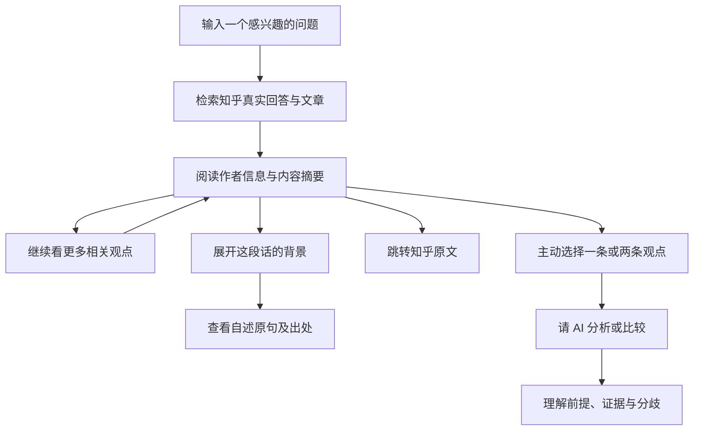
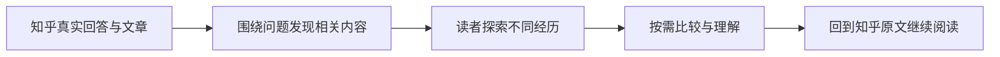
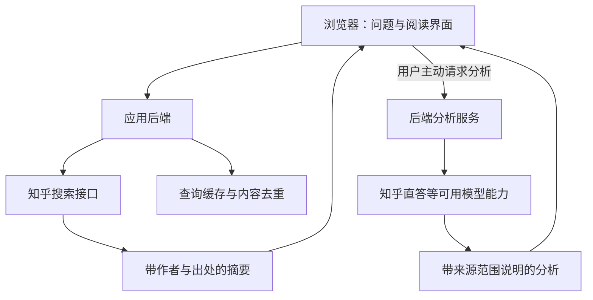

# 知辨｜在一个问题里，看见不同的人生

> **围绕一个问题，看看不同的人怎么说，以及他们为什么这样说。**

**知乎黑客松 2026 · 校园新锐季**  
拟参赛赛道：**知识炼金场**  
产品形态：面向桌面与手机浏览器的 Web 应用  
文档版本：报名阶段产品方案 · 2026 年 9 月 8 日

**项目状态：** 当前已完成产品方向讨论与官方接口文档的初步核对，正在进行体验设计。下文描述的是计划实现的产品能力；正式功能与实际效果将通过开发和真实接口测试验证。

---

## 01｜项目概述

知辨是一款基于知乎真实内容的观点探索工具。

用户输入一个感兴趣的问题，即可浏览不同作者的相关回答与文章，发现不同意见、类似经历，以及同一种建议背后的不同条件。每条内容保留作者信息、摘要标识和原文入口，让用户能够回到真实讨论中继续阅读。

除了观点本身，知辨还希望呈现“这段话是在什么背景下说的”。通过可展开的背景卡，产品展示平台提供的认证信息，以及内容中有明确依据、与话题相关的作者自述经历。读者先看到观点，有兴趣时再了解背景，逐步理解不同建议为什么会出现。

当用户想深入探讨某条观点时，可以主动邀请 AI 分析其前提、证据和适用范围；也可以选中两条内容，让 AI 帮助解释双方到底在什么地方存在分歧。

知辨的核心体验是轻松阅读与自由探索。用户可以始终作为一个好奇的旁观者，也可以在某句话触动自己时进一步追问。

## 02｜为什么想做知辨

### 同一个问题，为什么会得到截然不同的答案？

“第一份工作该选高薪，还是成长空间？”

“毕业后应该留在大城市吗？”

“兴趣应该成为职业吗？”

这些问题很难用一句统一的结论回答。人们的建议往往来自具体经历、不同目标和不同约束。一位作者看重职业机会，另一位在意生活成本；有人正在探索方向，有人需要尽快获得稳定收入。两条看似冲突的建议，可能各自在某种条件下成立。

我们观察到的产品机会，是帮助读者更容易发现这些差异。它仍是一项需要通过用户试用验证的需求判断，而非已经证明的市场结论。

### 阅读讨论时，用户可能遇到的三个困难

| 阅读中的困难 | 知辨计划提供的帮助 |
| --- | --- |
| 找到一条很有说服力的回答后，不知道还有哪些不同看法 | 沿着当前问题继续寻找更多相关意见与不同经历 |
| 看到了结论，却不了解这条建议的适用条件 | 展开带有原句依据的背景卡，了解内容中明确披露的背景 |
| 两条回答都觉得有道理，又说不清它们为什么冲突 | 按需调用 AI，对照双方的讨论对象、前提和证据 |

我们希望把“不断刷到更多答案”，变成一段更有方向的探索过程：读到一个看法，产生新的好奇，再遇见另一种真实经历。

## 03｜为谁而做

知辨首先面向喜欢阅读真实经验与多元讨论的大学生、初入职场者，以及对日常问题保持好奇的知乎读者。

- **处在人生选择阶段的人：** 想了解升学、就业、城市选择和职业发展的不同经历，为自己的问题补充视角。
- **喜欢围观讨论的人：** 愿意阅读有趣、有反差的真实表达，但不一定愿意立即发言或参与辩论。
- **希望进一步理解观点的人：** 对某条回答有疑问，希望找到反例，或比较两个看似矛盾的判断。

第一版会优先聚焦校园、学习与职业经验类问题，以较明确的场景验证内容质量和阅读体验。

## 04｜用户如何使用

### 一条可以随时停留、自由展开的阅读路径



*图 1：计划中的核心体验。阅读、查看背景和跳转原文均不以完成 AI 分析为前提。*

### 第一步：从自己的问题开始

用户可以自由输入问题，也可以从少量精选示例问题进入。首页优先把问题入口做好，让用户清楚自己将探索什么。

问题示例与实时热榜分开标注。后续如接入热榜，会使用真实接口返回的标题和链接。

### 第二步：先看真实的人怎么说

页面突出当前阅读的内容，同时保留已经看过的记录，方便前后对照。每张观点卡计划包含：

- 回答或文章标题；
- 作者昵称、头像及平台认证文案（如接口提供）；
- 明确标注的接口摘要；
- 接口提供的来源时间信息；
- 原文链接；
- 查看背景、继续探索和按需分析的入口。

搜索结果中的摘要不会被包装为全文。AI 生成的分析也不会混入作者内容，更不会被呈现为答主本人说过的话。

### 第三步：沿着兴趣寻找下一条内容

读完一条观点后，用户可以继续寻找不同意见、类似经历，或者直接查看原文。

这一环节的趣味来自真实内容的反差：刚读到“第一份工作应该选大公司”，下一位作者可能讲述自己在小团队承担完整项目的经历。读者在对照中发现新问题，而不需要先写出自己的立场。

“寻找不同意见”是一种探索意图，并不保证每次搜索都能找到直接反驳。尚未确认关系的内容会标为“更多相关看法”，避免把不同话题或不完整摘要误判为正反双方。

## 05｜特色功能：有依据的背景卡

### 看见经历，理解建议

背景卡希望补足阅读时容易遗漏的上下文。它关注的是“这段话在什么条件下成立”，每个背景项都需要有可以核对的来源。

**下面仅为界面结构示意，文字是虚构样例，不是真实知乎答主资料：**

```text
┌─────────────────────────────────────────────┐
│ 示例作者                                    │
│ 内容类型：回答 · 接口摘要                    │
│                                             │
│ 「我刚毕业时从小团队做起，                   │
│   第一年的收获是独立完成了一个项目……」       │
│                                             │
│ ▸ 看看这段话的背景                          │
│   发文时自述有小团队工作经历                │
│   依据：展开查看对应原句                    │
│                                             │
│ 查看原文    找更多看法    请 AI 分析          │
└─────────────────────────────────────────────┘
```

*图 2：观点卡与背景卡的结构示意；实际视觉样式将在开发中完善。*

背景卡默认折叠，让用户先接触观点，再主动查看背景。它计划遵循以下原则：

1. **来源清楚。** 区分平台认证字段与内容中的作者自述；每项自述展示对应原句和来源链接。
2. **保留时间语境。** 过去的自述只说明当时的情况，不据此断定作者现在的工作、收入或生活状态。
3. **与问题有关。** 优先呈现能够帮助理解建议的经历和条件，避免堆积无关个人信息。
4. **信息不足时留空。** 摘要没有交代的背景，不由模型补齐。
5. **不以身份代替论证。** 认证和经历是阅读线索，不等同于观点正确，也不用于给作者排名。

首版将优先使用官方接口提供的认证信息，以及当前返回文本中的明确自述。背景提取的准确性需要验证，特别要避免把引用、假设案例或他人的经历误认成作者本人经历。

## 06｜AI 如何参与

AI 的介入时机由用户决定。基础阅读流程不默认生成答案或辩论。

### 分析一条观点

用户点击“请 AI 分析”后，系统围绕选中的内容提供：

- 这段内容主要表达了什么；
- 它明确提出或依赖哪些前提；
- 当前可见内容提供了什么证据，还缺少什么信息；
- 哪些条件变化后，结论可能需要调整；
- 值得继续阅读或追问的问题。

分析既可以指出不足，也可以承认论证成立的部分，不以制造反对意见作为完成任务的标准。

### 比较两条观点

当用户同时选中两条内容时，可以提出“他们真的矛盾吗？”“各自在什么条件下成立？”等问题。

系统计划比较双方的讨论对象、经验条件、证据与结论。有些分歧可能来自事实判断不同，有些来自目标不同，也可能只是讨论的情况不同。若摘要不足以判断，分析应明确说明需要回到原文。

所有分析都会与作者内容分开展示，标明 AI 生成及分析范围。产品不通过人格标签、输赢裁定或伪精确分数来简化讨论。

## 07｜与知乎社区的契合

知乎的回答和文章承载着大量来自具体问题的经验表达。知辨选择保留这些表达的作者和出处，并围绕用户的问题组织阅读路径。

对读者而言，产品希望降低寻找不同意见和理解背景的成本；对创作者而言，每条内容都保留原文入口，使读者能够回到完整回答中了解上下文；对社区而言，产品尝试让已有讨论在新的阅读路径中重新被发现。

我们希望形成这样的内容流动：



*图 3：知辨计划连接的内容发现与原文阅读路径。*

## 08｜产品创新与体验取舍

| 设计选择 | 希望带来的体验价值 |
| --- | --- |
| 以问题连接多条真实内容 | 用户可以沿着一个具体困惑持续探索 |
| 把“找不同经历”作为阅读动作 | 为内容发现增加好奇心和反差感 |
| 提供可展开、有原句依据的背景卡 | 帮助用户理解建议的语境和边界 |
| 用户主动选择内容后才调用 AI | 让分析紧跟用户真实产生的疑问 |
| 支持双条观点比较 | 从单纯挑错，进一步解释分歧来自哪里 |
| 原文、摘要和 AI 分析明确区分 | 让用户知道自己正在阅读哪一种内容 |

第一版不会同时建设评论社区、积分体系或复杂社交关系。开发资源优先用于真实内容接入、阅读流畅度、背景依据展示，以及单条与双条分析的可靠性。

## 09｜计划采用的技术方案

产品拟采用 Web 前端与同源后端的结构，适配桌面和手机浏览器。前端负责问题输入、内容浏览、背景展开和分析结果展示；后端负责调用官方接口、整理响应、缓存及按需分析。



*图 4：拟采用的系统结构。具体模型权限和实际返回效果仍需联调验证。*

### 知乎开放能力的使用计划

| 官方能力 | 计划用途 | 已知边界 |
| --- | --- | --- |
| 知乎搜索 | 检索问题相关的回答和文章，获取作者、摘要及出处 | 当前已读文档把 ContentText 定义为摘要，不能承诺取得全文 |
| 搜索中的作者认证字段 | 展示官方返回的认证文案 | 当前搜索契约没有承诺完整个人简介或任意作者历史数据 |
| 知乎直答 | 用户主动触发的单条分析与双条比较 | 上下文遵循、模型权限及效果需要真实请求验证 |
| 知乎热榜 | 后续提供实时问题入口 | 核心阅读流程不依赖热榜 |
| 知乎 OAuth | 后续评估登录与个人体验扩展 | 不作为第一版公共阅读的前置条件 |

接口凭证保存在服务端。搜索将采用缓存、请求合并和内容去重，减少重复调用。接口无结果、限流或服务异常时分别提示；分析服务暂不可用时，用户仍应能够阅读已经取得的内容并访问原文。

## 10｜内容真实性与使用原则

知辨依赖知乎官方开放能力获取内容，并保留原始来源链接及必要的溯源信息。第一版不以批量爬取作者主页和历史帖子作为数据基础。

对于作者背景，仅呈现明确公开、与当前话题相关且具有依据的信息；不根据头像、昵称或发帖习惯推断敏感身份、人格或立场。背景卡用于解释语境，不用于对个人作出评价。

AI 生成内容明确标识，不冒充真实作者发言。对于仅有摘要的内容，系统不声称已经读过完整原文，不把未返回的信息补写为作者事实。原文中的外部指令也只作为文本处理，不能改变应用自身的规则。

具体内容展示、缓存期限和使用范围，将在开发接入时结合平台现行规范进一步核对。

## 11｜黑客松期间的开发与交付计划

### 优先完成的最小可用版本

1. **真实数据联调：** 验证搜索结果长度、作者认证字段、来源链接与相关内容覆盖情况。
2. **阅读主流程：** 完成输入问题、浏览摘要、保留已看内容、查看原文和继续探索。
3. **背景卡：** 接入认证字段，验证有原句依据的自述展示；信息不足时保持清晰的空状态。
4. **按需 AI 分析：** 实现单条分析与双条比较，明确来源和分析范围。
5. **体验与发布准备：** 完成手机适配、异常处理、线上部署验证和演示材料。

### 计划交付

- 评委可以实际操作的线上 Demo；
- 产品说明与技术方案；
- 展示项目结构与运行方式的代码仓库；
- 演示真实用户路径的项目视频。

这些均为交付目标，当前尚无已上线 Demo 或经过验证的真实数据分析效果。

## 12｜如何验证项目价值

我们会用小规模试用观察：用户能否快速找到与问题相关的内容，是否愿意继续探索，以及背景和 AI 分析是否帮助理解了新的条件。

| 验证方向 | 观察方式 |
| --- | --- |
| 内容相关性 | 检查返回内容是否回应了用户原始问题，而非仅包含相同关键词 |
| 不同视角的发现 | 观察“继续探索”是否带来新的经历或条件，避免重复内容 |
| 背景可靠性 | 对每个背景项核对对应原句，检查是否存在误归属或过时表述 |
| 分析可追溯性 | 检查 AI 是否把观点归给正确作者，是否杜撰来源或补足未知背景 |
| 使用门槛 | 观察用户是否能在不填写立场的情况下顺利完成阅读和原文跳转 |
| 阅读兴趣 | 记录试用者是否愿意继续看下一条，并结合访谈理解原因 |

以上为计划采用的验证方法，不代表项目已经取得相关测试数据。我们也不会将一次短暂使用包装为“已经提升用户思辨能力”。

## 13｜我们希望带来的体验

一个问题能够连接许多不同的生活。

有人给出的建议来自成功，有人来自遗憾；有人描述机会，有人提醒代价。把这些表达放回具体背景里，读者更容易理解看似矛盾的答案，也更容易找到值得继续追问的地方。

知辨希望让这样的探索变得轻松：输入一个问题，遇见一种看法，再发现另一段经历。在想深究的时候，请 AI 帮忙比较；在只想阅读的时候，也能带着好奇心继续看下去。

> **知辨——观点有出处，背景有依据，分歧有来由。**

---

## 附：资料依据与文档说明

本方案依据用户提供的《知乎黑客松 2026｜校园新锐季 参赛者开发流程文档》《知乎黑客松 2026｜校园新锐季 开发者手册》，以及已下载的官方 zhihu skill 中的黑客松指南和 HTTP API 文档整理。

- [赛事流程指南](https://pcnsiq9mmnww.feishu.cn/wiki/Pd1UwIIBriW0DBk8qlIczBAVnJc)
- [赛事规则文档](https://my.feishu.cn/docx/Mc80dR5XvoPaYDxcTasc04POnjd)
- [知乎开放平台](https://developer.zhihu.com/)

当前接口判断基于本地官方 skill 0.5.3-beta.20260904115023 的参考文档；HTTP API 参考文件标注核验时间为 2026-07-16。已安装 CLI 为 0.6.0-beta.20260907130936。正式接入前需要复核届时可用的接口契约和账号权限。

本文中的流程图与卡片示意均为项目设计表达，不是上线截图。流程图使用 Mermaid，支持 Mermaid 的 Markdown 阅读器可直接渲染；不支持的阅读器仍可阅读相邻文字说明。
